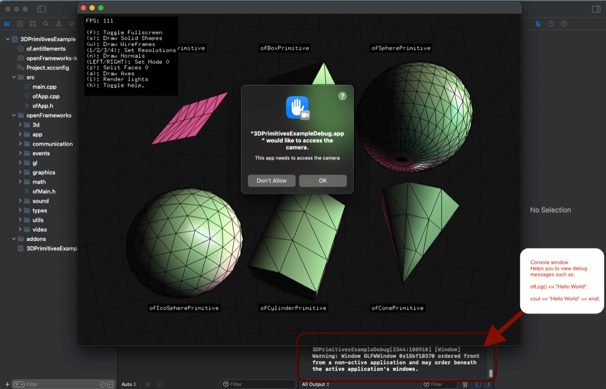
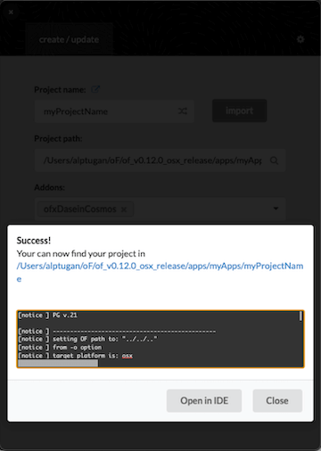
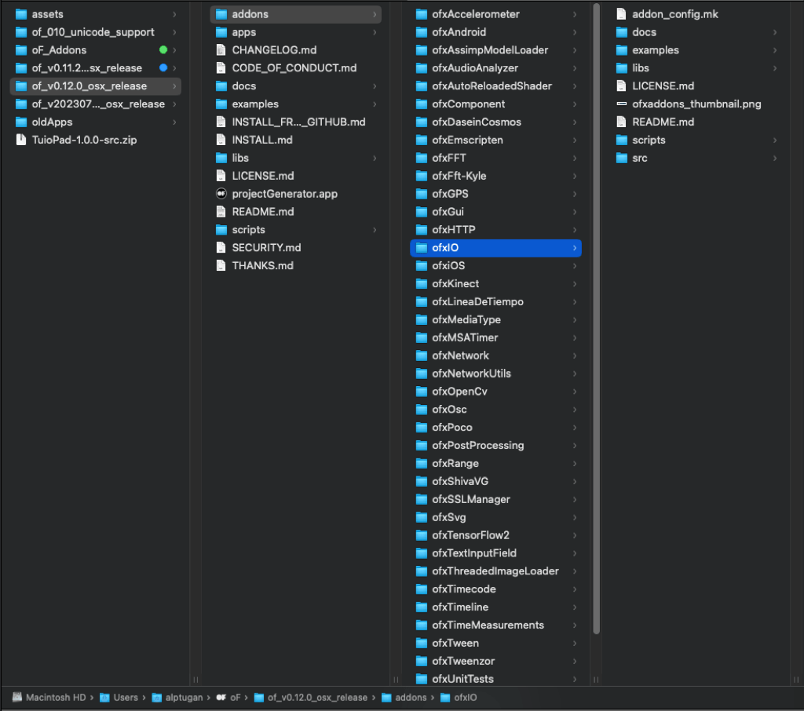
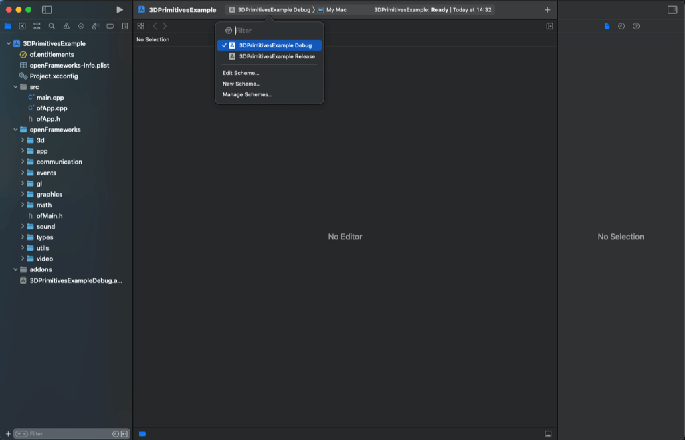

## -*- coding: utf-8 -*-
.. title: xcode

# Xcode 셋업 가이드

## 1. 첫 단계 

1. [OSX 앱스토어](https://itunes.apple.com/ca/app/xcode/id497799835?mt=12) 또는 [Apple Developer Portal](https://developer.apple.com/download/more/)에서 Xcode 14.1 이상 (15 베타 포함)을 설치합니다.

2. Xcode의 command line tools을 설치합니다.

명령줄 도구를 인스톨하려면, 우선 Xcode 설치를 완료한 후 터미널(응용프로그램/유틸리티/터미널.app 에서 찾을 수 있습니다)을 열고 다음 명령어를 입력한 후 Enter 키를 누릅니다:


```
xcode-select --install
```

위 명령어를 입력하면 command line tools를 입력하는 창이 뜰것입니다. **설치** 버튼을 눌러 설치를 진행합니다.


## 2. 셋업 테스트 하기

OF 앱을 빌드하고 실행할것입니다! 오픈프레임웍스에 포함된 예제중의 하나를 열어 테스트를 해보도록 하죠.

우선, 여러분의 컴퓨터안의 편리한 곳에 저희 웹사이트에서 다운받은 압축파일을 받아 압축을 풀어둡니다. 이 폴더는 오픈프레임웍스의 최상위 폴더(OF_ROOT로 알려집니다)가 될 것입니다. 아래에 나열된 것들은 오픈프레임웍스의 최상위 폴더에 위치한 주요 서브폴더들입니다 :

- **apps** 폴더는 여러분의 앱들이 위치할 곳이며, 여기에서 작업하게 될것입니다.
- **examples** 폴더에는 비디오, 3D 그래픽, 사운드, 폰트 등등 특정 컨셉의 데모를 위한 미리 제작된 앱들이 담겨있습니다.
- **addons** 폴더는 [오픈프레임웍스 애드온](http://ofxaddons.com/)(community contributed extensions to the openFrameworks core)을 담아주는 곳입니다.
- **projectGenerator** 폴더에는 프로젝트 생성기가 들어있습니다. 오픈프레임웍스의 새 앱을 생성할때 유용합니다.

3DPrimitivesExample로 테스트를 해봅시다. **examples**폴더를 열고, 안에 **3d**폴더에 들어가보면 **3DPrimitivesExample**폴더가 보입니다. 내부에 2개의 폴더와 몇몇의 파일들을 볼 수 있을것입니다.


아래는 오픈프레임웍스 앱의 기본 구조입니다:

- **src** 폳더는 일반적으로 앱의 소스파일들이 담길 곳입니다. 
- **bin** 폴더는 컴파일되어 실행이 가능한 앱이 담기는 곳입니다. 이 폴더안의 **data**폴더는 이미지나 사운드파일과 같이 앱에서 불러올 외부파일들을 담아두는 곳입니다.

`.xcodeproj`확장자를 갖는 파일은 Xcode에서 열 수 있는 파일입니다. 열어보면, 아래 이미지와 비슷한 화면을 볼 수 있습니다. 아래 이미지에서 볼 수 있는것과 같이 프로젝트 내부의 좌측바를 확장하여 `ofApp.cpp`파일등 여러분이 열어보고싶은 파일을 선택하여 열어볼 수 있습니다.

이 문서가 작성된 시점에서는 Xcode 14.3.1버전이므로, 아마도 여러분이 미래에서 오셨다면 조금 다를수 있습니다.

`3DPrimitivesExample.xcodeproj` 프로젝트를 더블클릭하면 Mac OS에서 보안 이슈로 인해 알림 팝업 창이 나타납니다. **열기** 버튼을 클릭하시면 됩니다.


맨 위에서 폴더 아이콘이 선택된 경우, 왼쪽 바`(1)`는 일반적인 프로젝트 브라우저로 프로젝트 파일을 표시합니다. 또한 앱을 빌드하는 동안 발생한 오류도 표시합니다. `(2)`번은 앱을 빌드 할 수 있는 버튼입니다.


중앙의 섹션이 메인 편집기`(3)`입니다. 프로젝트 브라우저에서 선택한 파일을 편집할 수 있습니다. `.cpp`나 `.h`와 같은 소스파일을 위한 텍스트 에디터로 사용되는것이 보통이지만, 프로젝트파일의 상단에 위치한 프로젝트 세팅을 클릭해 변경하거나, 이미지/비디오/사운드파일들을 확인할 수도 있습니다.

우측은 보조사이드바로써`(4)`, 오픈프레임웍스에서는 거의 필요가 없습니다. cmd-option-0 단축키 또는 우측상단의 파란 아이콘을 클릭해 숨길 수 있습니다.

작업할 때 유용한 단축키입니다, 작은 화면에서 유용할 것입니다:
- `⌘ + 0`은 왼쪽 사이드바를 표시하거나 숨깁니다.
- `⌘ + ⌥ + 0`은 오른쪽 사이드바를 표시하거나 숨깁니다.
- `⌘ + r`은 프로젝트를 컴파일하고 실행합니다.

처음으로 오픈프레임웍스 프로젝트를 컴파일할 때에는, 거의 1분 정도가 걸리는데 이는 오픈프레임웍스를 컴파일 하기 때문입니다. 추후 오픈프레임웍스를 업데이트하거나 오픈프레임웍스 내부 파일들을 편집하지 않는다면 이 과정은 한 번만 필요합니다. 오픈프레임웍스 자체의 컴파일이 끝나면, Xcode는 예제 파일을 컴파일 할 것이고, `Build Succeeded` 메시지와 함께 예제 앱이 실행될 것입니다..



실행된 예제 앱의 창을 닫으면, 새로운 패널이 Xcode의 하단에 추가되어있음을 알 수 있습니다. 이것은 `ofLog` 메세지가 출력되거나 디버깅을 위해 사용되는 콘솔 패널입니다. `⌘ + shift + y` 단축키로 이 패널을 감추거나 표시할 수 있습니다.

오픈프레임웍스가 컴파일될 때 일반적으로 몇몇 경고들이 출력될 것입니다만, 이는 완벽히 정상입니다.

## 3. 새로운 프로잭트 생성하기

자 이제 셋업이 잘 되었는지 확인되었습니다. 이제부턴 새 프로젝트로 시작해볼 단계입니다. **projectGenerator**폴더에 들어가보면, 오픈프레임웍스의 앱을 쉽게 생성해주는 `projectGenerator.app`을 실행해 봅니다.


`(1)` : **프로젝트에 적절한 이름을 지정합니다.**

`(2)` : **프로젝트 경로는 그대로 둘 수 있습니다.**

`(3)` : **내장 또는 로컬 openFrameworks 애드온을 추가할 수 있습니다.**


`(4)` : **"Generate" 버튼을 누릅니다.**




이후 프로잭트 생성기를 닫고, `apps/myApps/myProjectName` 폴더로 이동합니다. 
`myProjectName.xcodeproj`를 Xcode로 열서 좌측 프로잭트 탭에서 **src**폴더 안의 `ofApp.cpp` 파일을 선택합니다.

그럼 `setup()`, `update()`, `darw()` 함수들과 몇몇 빈 함수들이 작성된 기본 앱의 템플릿을 볼 수 있습니다.


이제 간단한 앱을 만들어보겠습니다. 화면 왼쪽 상단에 텍스트와 중앙에 여러 개의 움직이는 도형들을 만들어 봅시다. `draw()` 함수에 다음 코드를 추가한 다음 `⌘ + r`을 누르거나 (또는 실행 버튼을 클릭)하여 새로운 앱을 실행합니다:


```
ofDrawBitmapStringHighlight("Everything works!", 20, 20);

// Draw 100 circles
for(int i = 0; i < 100; i++) {
    // Set animation speed
    float speed = 2.0;
    
    // set left-to-right oscillation
    float sinX = sin(i + ofGetElapsedTimef() * speed) * 100;
    
    // set opacity of each circle
    float sinAlpha = ofMap(sin(i + ofGetElapsedTimef() * speed),-1, 1, 0, 200);
    
    // set radius of each circle
    float sinRadius = ofMap(sin(i * ofGetElapsedTimef() * 0.05),-1, 1, 5, 30);
    
    // set color to white and opacity to sinAlpha
    ofSetColor(255,255,255,sinAlpha);
    
    // Finally draw each circle on window
    ofDrawCircle(sinX + ofGetWidth()*0.5, i * 10, sinRadius);
}
```


## 4. 프로젝트에 파일 추가하기

작업을 하면서, 새로운 파일을 추가하고 싶을 때가 있습니다. 이 파일들은 여러분의 프로젝트를 위해서만 작성되거나 혹은 애드온, 혹은 다른 사람이 작성한 외부 라이브러리가 될수도 있겠죠.

새 파일을 만드는 방법이 몇가지 있습니다. 첫번째 방법은 Xcode에서 **src** 폴더에 우측버튼을 누르고, **New File**을 선택하는 것입니다. 다른 방법은 메뉴에서 **File > New > File..** 을 선택하는 것입니다.


다이얼로그가 뜨면, OS X > Source로 이동하여 C++ 파일을 선택합니다. Xcode는 `.cpp`와 `.h`을 세트로 하여 자동으로 생성해줍니다. 따라서 기본 이름 **myNewClass**만 제공하면 됩니다. 다이얼로그에서 새 파일의 경로를 **src**폴더로 지정했는지 체크하시기 바랍니다.


새 파일을 **src** 폴더에 저장하라는 프롬프트가 나타나면 Xcode에게 알려줘야 합니다.


마지막으로, 추가한 파일은 Xcode 편집기에 표시됩니다.


## 5. 프로젝트에 ofxAddons 추가
1. [ofxAddons 웹 사이트](https://ofxaddons.com/categories)에서 외부 애드온을 사용하려면 먼저 원하는 애드온을 클릭합니다. 웹 사이트에서는 레포지토리 소스 페이지로 연결됩니다.


2. 폴더를 zip 파일로 다운로드합니다.


3. zip 파일의 내용을 추출하고 `-master` suffix를 제거합니다.


4. 폴더를 `openframeworks/addons` 디렉토리로 이동합니다.



5. 프로젝트 생성기를 엽니다. `import` 버튼을 사용하거나 프로젝트 폴더를 **projectGenerator** 앱으로 드래그하여 놓습니다.


6. `openFrameworks/addons` 폴더로 복사한 애드온의 이름을 입력합니다. 관련 ofxAddon이 즉시 나타날 것입니다.


7. `Update` 버튼을 누릅니다. 그런 다음 업데이트된 프로젝트를 열 수 있습니다.

## 6. FAQ
1. **XCode 코드 자동완성 기능이 예상대로 작동하지 않습니다.**

    현재 (2023년 7월 9일) XCode에서는 코드 자동완성 문제가 보고되어 있습니다. 다음 포럼 [글](https://forum.openframeworks.cc/t/psa-autocompletion-is-broken-in-xcode-14-1/42181)을 참조하세요.

2. **XCode 계정이 없습니다. XCode를 다운로드하는 방법이 있나요?**
    
    https://www.xcodes.app

3. **오래된 애드온의 경우 XCode에서 오류가 발생합니다. 어떻게 해결할 수 있나요?**

    애드온이 제대로 작동하는 것을 확인하면 응용프로그램을 오래된 `Rosetta` 아키텍처로 컴파일해 볼 수 있습니다. 일부 라이브러리는 새로운 맥에서 효율적으로 실행되기 위해 Apple Silicon 프로세서 (arm64 아키텍처)에 대한 컴파일이 필요합니다. 그러나 이러한 라이브러리를 Intel 기반 맥용으로 빌드한 경우에도 `Rosetta` 모드로 전환하여 사용할 수 있습니다.
    - XCode를 엽니다.
    - oF 프로젝트를 엽니다.
    - 상단 메뉴로 이동 -> Product -> Destination Architecture -> Show Rosetta Destinations 
    
    - 다시 실행합니다.

4. **프로젝트 폴더를 컴퓨터의 다른 위치로 이동했습니다. 어떻게 해야 하나요?**

    - 프로젝트 생성기를 엽니다.
    - 프로젝트 폴더를 드래그 & 드롭합니다. 
    - **Update**를 클릭합니다.
    - 다시 *.xcodeproj 파일을 열어 보세요.
    

5. **앱이 낮은 FPS 또는 느린 속도로 실행됩니다. 성능을 향상시키려면 어떻게 할 수 있나요?**
    
    여러 이유가 있을 수 있습니다. 포럼에 질문하기 전에 다음 팁을 시도해 보세요.
    - `update()` 및 `draw()` 함수에서의 콘솔 출력 메시지 주석 처리하기. `ofLog()`, `ofLogNotice()`, `ofLogVerbose()`, `cout` 등과 같은 명령어가 있는지 확인하세요.
    - 앱을 `Release` 모드로 실행해 보세요.
    