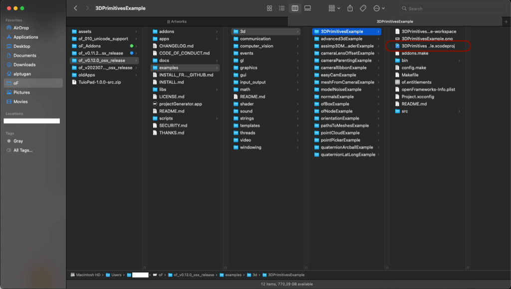
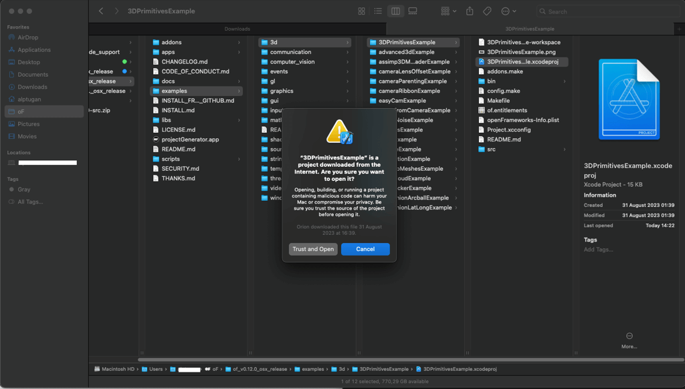
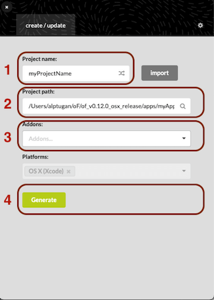
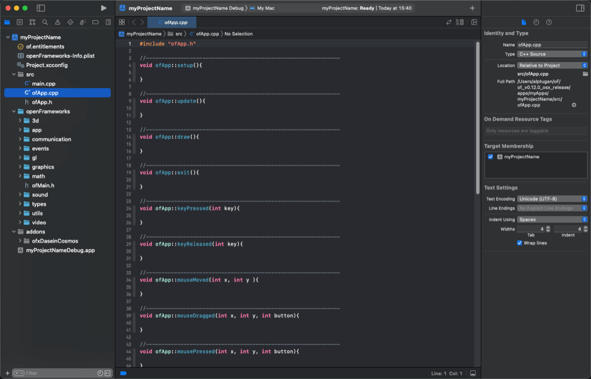
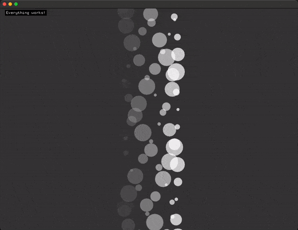
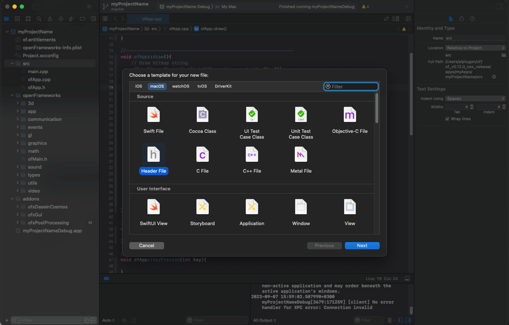
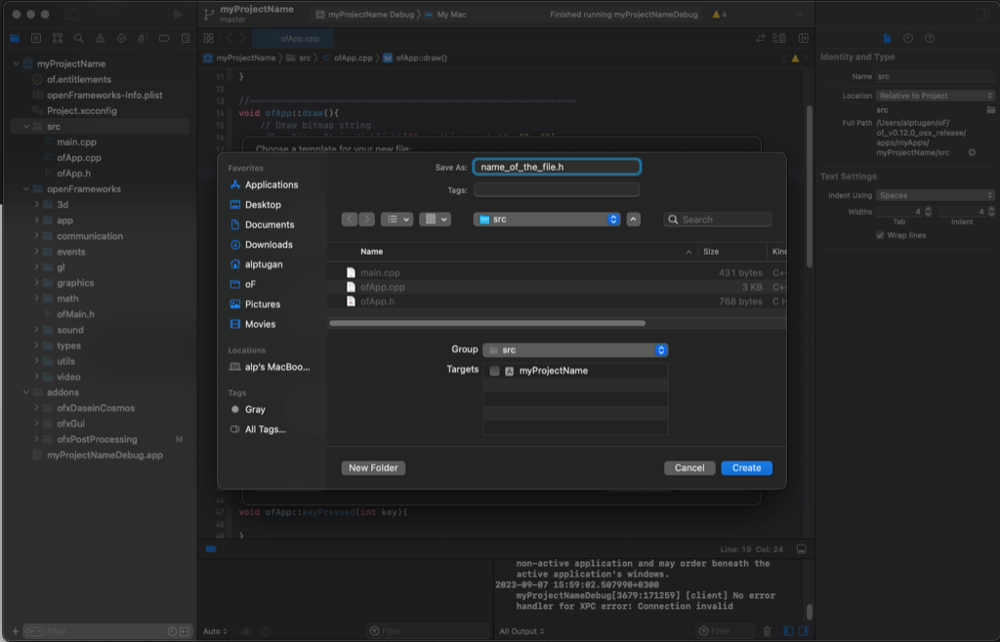
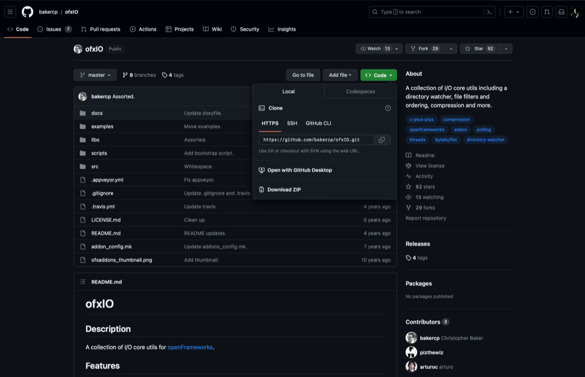
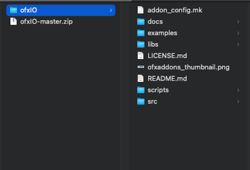
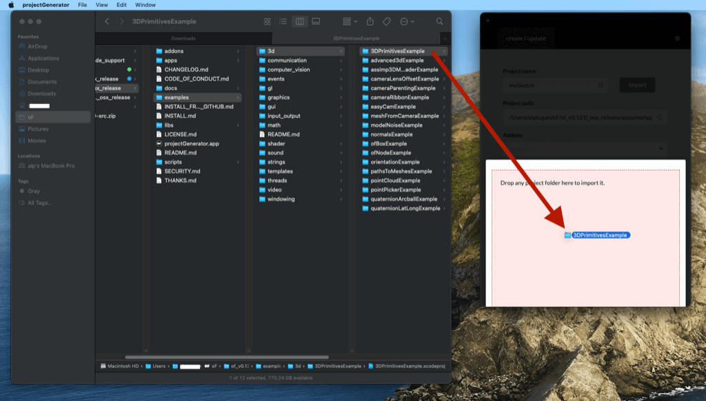

## -*- coding: utf-8 -*-
.. title: xcode

# Xcode Setup Guide

## 1. First Steps

1. Install Xcode 14.1 or newer (15 beta) from the [OSX App Store](https://itunes.apple.com/ca/app/xcode/id497799835?mt=12) or [Apple Developer Portal](https://developer.apple.com/download/more/). 
   
2. Install Xcode's command line tools

To install the command line tools, first finish installing Xcode then open up a terminal (you can find it at Applications/Utilities/Terminal.app), type the following and hit enter:

```
xcode-select --install
```

This should prompt you to install the command line tools. Select "Install" to begin the process.


 

## 2. Testing Your Setup

At this point, you should have all you need to build and run OF apps! Let's test it by opening one of the examples that comes with openFrameworks.

First, extract the folder you downloaded from this website and put it somewhere convenient. This folder will be referred to as your openFrameworks root folder (also known as OF_ROOT). Here's some of the key subfolders inside the openFrameworks root folder:

- **apps** will be where your own apps will go as you work on them
- **examples** contains a set of pre-made apps that demonstrate specific concepts like dealing with video, 3d graphics, sound, fonts and so on
- **addons** is where you can store [openFrameworks addons](http://ofxaddons.com/) (community contributed extensions to the openFrameworks core)
- **projectGenerator** contains the project generator, which is useful for creating new openFrameworks apps

Let's test your setup with the 3DPrimitivesExample. Open the **examples** folder, then the **3d** folder and finally the **3DPrimitivesExample** folder. Inside, you should see 2 folders and a few files.



This follows the basic structure of an openFrameworks app.

- **src** is typically where your app's source files will go
- **bin** is where your finished runnable app will end up, as well as your
- **data** folder which is for assets like images, sound files, etc.

The file with the `.xcodeproj` extension is the file you should open in Xcode. Open it now and you should see something similar to the following. You may need to expand the project in the left bar and drill down to the `ofApp.cpp` file as shown in the image below in order to see anything interesting.

As of this writing Xcode is on version 14.3.1, so you may see something slightly different if you live in the future. 

When you double-click the `3DPrimitivesExample.xcodeproj` project, Mac OS displays a notification pop-up window because of security issues. You can safely hit "Trust and Open".



The bar on the left is your general purpose project browser `(1)`, which will show your project's files (if the folder icon is selected at the top), as well as errors that crop up while trying to build your app `(2)` (the triangular icon).


In the middle is your main editor `(3)`. It will show you an appropriate editor for whatever file you've selected in the project browser. This is usually a text editor for source files (`.cpp` and `.h` files), but will show you your project's settings if you select the project file at the top, or will let you examine image / video / sound files as well.

On the right is an auxilliary sidebar `(4)` which is almost always useless for openFrameworks. You can hide it by clicking the sidebar icon in the top right. Handy shortcuts for working on small screens: 
- `⌘ + 0` will show or hide the left sidebar. 
- `⌘ + ⌥ + 0` will show or hide right sidebar.
- `⌘ + r` will compile the project and run.


The first time you compile an openFrameworks project, it will likely take a minute or so as openFrameworks gets compiled. This usually only needs to be done once, unless you update openFrameworks or edit any of its internal files. After openFrameworks itself is finished, Xcode will compile the example and you should see a "Build Succeeded" message and a window with the example app happily spinning away.


After closing the example, you may see a new panel open at the bottom of the Xcode window. This is the console where `ofLog` messages will show up, as well as another panel which is used for debugging. You can show and hide this panel with cmd-shift-y.

It is typical for there to be some warnings generated when openFrameworks is compiled. This is unfortunate, but perfectly normal.

## 3. Generating a New Project

Now that you've verified your setup, it's a good time to start a new project from scratch. In the **projectGenerator** folder, you'll find `projectGenerator.app` which will make it easy to create new openFrameworks apps. 

Open the `projectGenerator.app`



`(1)` : **Give a relevant name to your project.**

`(2)` : **You can leave project path as it is.**

`(3)` : **You can add built-in or local openframeworks addons.**


`(4)` : **Hit "Generate" button**


Afterwards, close the project generator and navigate to the `apps/myApps/myProjectName` folder. Open `myProjectName.xcodeproj` in Xcode, expand the project in the browser on the left, expand the **src** folder and select the `ofApp.cpp` file.

You should now be looking at the blank app template, with empty `setup()`, `update()` and `draw()` functions (as well as many other empty functions).



Let's make a simple app which draws some text in the top left corner and bunch of animating shapes in the middle of the window. In the `draw()` function, add the following codes then hit `⌘ + r` (or click the run button) to run your new app:

```
ofDrawBitmapStringHighlight("Everything works!", 20, 20);

// Draw 100 circles
for(int i = 0; i < 100; i++) {
    // Set animation speed
    float speed = 2.0;
    
    // set left-to-right oscillation
    float sinX = sin(i + ofGetElapsedTimef() * speed) * 100;
    
    // set opacity of each circle
    float sinAlpha = ofMap(sin(i + ofGetElapsedTimef() * speed),-1, 1, 0, 200);
    
    // set radius of each circle
    float sinRadius = ofMap(sin(i * ofGetElapsedTimef() * 0.05),-1, 1, 5, 30);
    
    // set color to white and opacity to sinAlpha
    ofSetColor(255,255,255,sinAlpha);
    
    // Finally draw each circle on window
    ofDrawCircle(sinX + ofGetWidth()*0.5, i * 10, sinRadius);
}
```




## 4. Adding Files to Your Project

As your project grows, you'll probably want to start adding new files. These files might be ones written specifically for your project, or they could be addons or external libraries other people have written.

Making new files can be done in a few ways. One is to right click your "src" folder in Xcode, and select "New File..", the other is to go to the menu and select File > New > File...


In the dialog that pops up, navigate to macOS -> Source and then select C++ file. Xcode will create a `.cpp` and `.h` pair for you automatically, so just give it a base name ("myNewClass") and let it do the rest. 



Make sure you tell Xcode to place the new files in your "src" folder when prompted.



Finally, the file you add displays in the XCode editor.


## 5. Adding ofxAddons to Your Project
1. If you want to use an external addon from [ofxAddons web-site](https://ofxaddons.com/categories). Click on the addon name. The web site directs you to the repository source page. 

 

2. Download the folder as a zip file.

 

3. Extract the zip content and remove the `-master` suffix.



4. Move the folder into your openframeworks/addons directory


5. Open the project generator. Use the `import` button or drag & drop your project folder onto the projectGenerator app.



6. Type the name of the addon(s) that you copied into the openFrameworks/addons folder. It should immediately shows-up the relevant ofxAddon.


7. Hit `Update` button. Then you can open the updated project.

## 6. FAQ
1. **XCode code completetiton support doesn't work as expected.**

    As of this date (07.09.2023) there are repoted code completition issues on XCode. Refer to the following forum [post](https://forum.openframeworks.cc/t/psa-autocompletion-is-broken-in-xcode-14-1/42181).

2. **I don't have XCode account. Is there a way to download XCode?**
    
    https://www.xcodes.app

3. **When I use out-of-date addons, XCode throws errors. How can I fix it?**

    If you are sure that the addon is working properly, you can try to compile your application using the older "Rosetta" architecture. Some of the libraries need to be compiled for Apple Silicon Processor (arm64 architecture) to run efficiently on new Macs. But you still use these libraries even if they are built for Intel-based Macs by switching to the `Rosetta` mode;
    - Open XCode
    - Open your oF project
    - Goto the top menu -> Product -> Destination Architecture -> Show Rosetta Destinations 
    
    - Hit run again.

4. **I move my project folder to a different location on my computer. What should I do?**

    - Open the project generator.
    - Drag & Drop your project folder. 
    - Hit "Update"
    - Try again to open your *.xcodeproj file.
    

5. **My app runs in low FPS or slowly. What can I do to increase performance?**
    
    There can be several reasons of your app getting slow down. Before asking in the forum you give a try the following tips;
    - Try commenting out console output messages in `update()` and `draw()` functions have such `ofLog()`, `ofLogNotice()`, `ofLogVerbose()`, `cout`, etc... commands.
    - Try to run the app in `Release` mode
    
